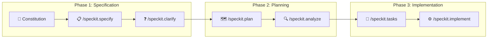
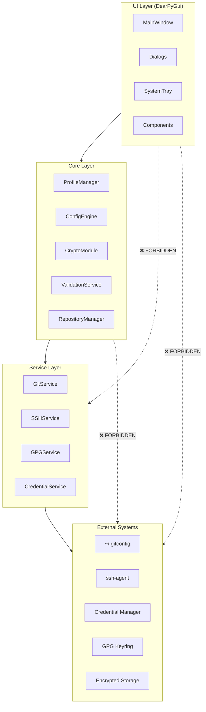

# AGENTS.md — Git Profile Switcher

> **AI Agent Guidance Document**  
> This document provides essential context, constraints, and guardrails for AI coding agents working on the Git Profile Switcher project. It follows [GitHub Spec Kit](https://github.com/github/spec-kit) conventions for Spec-Driven Development (SDD).

---

## Table of Contents

1. [Project Overview](#project-overview)
2. [Spec-Driven Development Workflow](#spec-driven-development-workflow)
3. [Project Constitution](#project-constitution)
4. [Technology Stack (Non-Negotiable)](#technology-stack-non-negotiable)
5. [Architectural Constraints](#architectural-constraints)
6. [Project Directory Structure](#project-directory-structure)
7. [Documentation Standards](#documentation-standards)
8. [Coding Standards & Conventions](#coding-standards--conventions)
9. [Security Requirements](#security-requirements)
10. [Testing Requirements](#testing-requirements)
11. [Build & Distribution Requirements](#build--distribution-requirements)
12. [Git Workflow](#git-workflow)
13. [Agent Behavioral Guidelines](#agent-behavioral-guidelines)
14. [Prohibited Actions](#prohibited-actions)
15. [Quality Gates](#quality-gates)

---

## Project Overview

**Git Profile Switcher** is a Windows desktop utility that enables developers to seamlessly switch between multiple Git/GitHub user profiles. The application provides a modern, GPU-accelerated graphical interface for managing Git identities, SSH keys, GPG signing keys, and cached credentials.

### Key Capabilities

- Store and manage multiple Git profiles with associated SSH and GPG keys
- One-click switching between profiles (global and repository-local)
- Secure encrypted storage with master password protection
- System tray integration for quick access
- Import/export profiles for backup and migration

### Target Platform

- **Operating System:** Windows 10/11 (64-bit only)
- **Runtime:** Portable executable (no installation required)

---

## Spec-Driven Development Workflow

This project follows GitHub Spec Kit's Spec-Driven Development methodology. All AI agents MUST adhere to the following workflow:



### Workflow Commands

| Command | Purpose | When to Use |
|---------|---------|-------------|
| `/speckit.constitution` | Define non-negotiable project principles | Project initialization |
| `/speckit.specify` | Create feature specifications | Starting new features |
| `/speckit.clarify` | Resolve ambiguities in specs | Before planning |
| `/speckit.plan` | Generate technical implementation plan | After spec approval |
| `/speckit.analyze` | Validate consistency across artifacts | Before implementation |
| `/speckit.tasks` | Break plan into actionable tasks | After plan approval |
| `/speckit.implement` | Execute implementation tasks | After task breakdown |

### Critical Workflow Rules

1. **Never skip phases** — Each phase builds on the previous; skipping creates gaps
2. **Always read the constitution** — Before any implementation, load and verify against `constitution.md`
3. **Specifications are the source of truth** — Code must implement specs, not the other way around
4. **Tasks must be atomic** — Each task should be completable in a single commit
5. **Human approval required** — Wait for explicit approval before advancing phases

---

## Project Constitution

The following principles are **NON-NEGOTIABLE** and supersede all other guidance. Every implementation decision MUST comply with these articles.

### Article I: Security First

```
All sensitive data (SSH keys, GPG keys, passphrases, credentials) MUST be encrypted 
at rest using AES-256-GCM with PBKDF2-derived keys. No plaintext storage of secrets 
is permitted under any circumstances. Memory containing decrypted secrets MUST be 
cleared immediately after use.
```

### Article II: Single Responsibility Architecture

```
Every module MUST have a single, well-defined responsibility:
- UI components handle ONLY presentation and user interaction
- Services handle ONLY business logic for their domain
- Models handle ONLY data structure definitions
- No module shall mix concerns or bypass architectural layers
```

### Article III: Windows-Native Integration

```
All system integrations MUST use Windows-native APIs and services:
- SSH Agent: Windows OpenSSH ssh-agent service (NOT third-party agents)
- Credential Storage: Windows Credential Manager via keyring library
- Notifications: Windows Toast Notifications via win32 APIs
- Startup: Windows Registry for auto-start functionality
```

### Article IV: Portable Execution

```
The final artifact MUST be a single portable .exe file:
- No installation required
- No admin privileges required for normal operation
- User data stored in %APPDATA%/GitProfileSwitcher
- All dependencies bundled via PyInstaller
```

### Article V: Graceful Degradation

```
The application MUST handle missing external dependencies gracefully:
- If Git is not installed: Show clear error, do not crash
- If SSH Agent is not running: Offer to start it or show instructions
- If GPG is not installed: Disable GPG features, not entire app
- All errors MUST be user-friendly, never raw stack traces
```

### Article VI: Test-Driven Development

```
All business logic MUST be covered by tests:
- Unit tests for all service methods
- Integration tests for external system interactions (mocked)
- No feature is complete without corresponding test coverage
- Tests MUST be written BEFORE implementation when possible
```

### Article VII: Commit Discipline

```
Every completed task requires its own commit with structured message:
- Format: <type>(<scope>): <description>
- Types: feat, fix, refactor, test, docs, style, chore
- Scope: module or feature area
- Description: imperative mood, lowercase, no period
- Example: feat(profile-manager): add profile validation service
```

---

## Technology Stack (Non-Negotiable)

The following technology choices are **LOCKED** and MUST NOT be changed without explicit human approval and documented justification.

### Core Technologies

| Component | Technology | Version | Rationale |
|-----------|------------|---------|-----------|
| Language | Python | 3.11+ | Modern features, broad library support |
| GUI Framework | DearPyGui | 1.10+ | GPU-accelerated, modern aesthetic |
| Encryption | cryptography | 41.0+ | Industry-standard, FIPS-compliant |
| SSH Operations | paramiko | 3.3+ | Pure Python SSH implementation |
| Git Operations | GitPython | 3.1.40+ | Comprehensive Git manipulation |
| GPG Operations | python-gnupg | 0.5.2+ | GnuPG wrapper |
| Credential Manager | keyring | 24.3+ | Cross-backend credential storage |
| Windows APIs | pywin32 | 306+ | Native Windows integration |
| System Tray | pystray | 0.19+ | Cross-platform tray icons |
| Packaging | PyInstaller | 6.0+ | Single-file executable creation |

### Prohibited Technologies

The following are explicitly **FORBIDDEN** in this project:

| Technology | Reason |
|------------|--------|
| Electron | Excessive resource usage, not Python-native |
| Tkinter | Outdated appearance, not GPU-accelerated |
| PyQt/PySide | Licensing complexity, excessive overhead |
| Web frameworks (Flask, FastAPI) | Desktop app, not web service |
| Async frameworks (asyncio) | DearPyGui has own event loop |
| SQLite/PostgreSQL | Overkill for config storage, use JSON |
| Third-party SSH agents | Must use Windows OpenSSH |

---

## Architectural Constraints

### Layered Architecture



### Dependency Rules

1. **UI Layer** → May only import from Core Layer
2. **Core Layer** → May only import from Services Layer and Models
3. **Services Layer** → May only import from Models and external libraries
4. **Models** → May only import standard library and dataclasses

### State Management

- **Application state** managed centrally in `ProfileManager`
- **UI state** managed locally in each view/component
- **NO global variables** for state management
- **NO singletons** except for the main application instance

---

## Project Directory Structure

```
GitProfileSwitcher/
├── .specify/                          # Spec Kit configuration
│   ├── memory/
│   │   └── constitution.md            # Project constitution
│   ├── scripts/                       # Spec Kit helper scripts
│   └── templates/                     # Spec/Plan/Task templates
│       ├── spec-template.md
│       ├── plan-template.md
│       └── tasks-template.md
│
├── specs/                             # Feature specifications
│   └── ###-feature-name/              # Numbered feature directories
│       ├── spec.md                    # Feature specification
│       ├── plan.md                    # Implementation plan
│       ├── tasks.md                   # Task breakdown
│       ├── research.md                # Research findings
│       └── contracts/                 # API contracts if applicable
│
├── src/                               # Source code
│   ├── __init__.py
│   ├── main.py                        # Application entry point
│   │
│   ├── ui/                            # UI Layer
│   │   ├── __init__.py
│   │   ├── app.py                     # Main DearPyGui application
│   │   ├── theme.py                   # UI theme and styling
│   │   ├── views/                     # Full-screen views
│   │   │   ├── __init__.py
│   │   │   ├── profile_list_view.py
│   │   │   ├── repository_view.py
│   │   │   └── settings_view.py
│   │   ├── dialogs/                   # Modal dialogs
│   │   │   ├── __init__.py
│   │   │   ├── profile_dialog.py
│   │   │   ├── password_dialog.py
│   │   │   └── import_export_dialog.py
│   │   ├── components/                # Reusable UI components
│   │   │   ├── __init__.py
│   │   │   ├── profile_card.py
│   │   │   ├── status_bar.py
│   │   │   └── sidebar.py
│   │   └── system_tray.py             # System tray integration
│   │
│   ├── core/                          # Core business logic
│   │   ├── __init__.py
│   │   ├── profile_manager.py         # Profile CRUD operations
│   │   ├── config_engine.py           # Configuration orchestration
│   │   ├── crypto.py                  # Encryption/decryption
│   │   ├── validation.py              # Credential validation
│   │   └── repository_manager.py      # Repository registry
│   │
│   ├── services/                      # External system services
│   │   ├── __init__.py
│   │   ├── git_service.py             # Git config operations
│   │   ├── ssh_service.py             # SSH agent operations
│   │   ├── gpg_service.py             # GPG keyring operations
│   │   └── credential_service.py      # Windows Credential Manager
│   │
│   ├── models/                        # Data models
│   │   ├── __init__.py
│   │   ├── profile.py                 # Profile dataclass
│   │   ├── repository.py              # Repository dataclass
│   │   └── settings.py                # Settings dataclass
│   │
│   └── utils/                         # Utility functions
│       ├── __init__.py
│       ├── paths.py                   # Path utilities
│       ├── windows.py                 # Windows-specific utilities
│       └── notifications.py           # Toast notifications
│
├── tests/                             # Test suite
│   ├── __init__.py
│   ├── conftest.py                    # Pytest fixtures
│   ├── unit/                          # Unit tests
│   │   ├── __init__.py
│   │   ├── test_crypto.py
│   │   ├── test_profile_manager.py
│   │   └── test_validation.py
│   ├── integration/                   # Integration tests
│   │   ├── __init__.py
│   │   ├── test_git_service.py
│   │   └── test_ssh_service.py
│   └── fixtures/                      # Test data
│       ├── sample_keys/
│       └── sample_configs/
│
├── assets/                            # Static assets
│   ├── icons/
│   │   ├── app_icon.ico
│   │   ├── app_icon.png
│   │   └── tray_icons/
│   └── fonts/
│
├── docs/                              # Project documentation
│   ├── README.md                      # Project overview
│   ├── DEVELOPMENT.md                 # Development setup guide
│   ├── ARCHITECTURE.md                # Architecture documentation
│   ├── CONTRIBUTING.md                # Contribution guidelines
│   ├── CHANGELOG.md                   # Version history
│   ├── SECURITY.md                    # Security documentation
│   └── USER_GUIDE.md                  # End-user documentation
│
├── scripts/                           # Build and utility scripts
│   ├── build.ps1                      # PowerShell build script
│   ├── build.sh                       # Bash build script
│   └── generate_icons.py              # Icon generation utility
│
├── .github/                           # GitHub configuration
│   ├── prompts/                       # GitHub Copilot prompts
│   ├── workflows/                     # GitHub Actions
│   │   ├── ci.yml
│   │   └── release.yml
│   └── ISSUE_TEMPLATE/
│
├── .claude/                           # Claude Code configuration
│   └── commands/                      # Custom slash commands
│
├── AGENTS.md                          # This file
├── PRD.md                             # Product Requirements Document
├── CLAUDE.md                          # Claude Code context file
├── requirements.txt                   # Python dependencies
├── requirements-dev.txt               # Development dependencies
├── pyproject.toml                     # Project metadata
├── build.spec                         # PyInstaller specification
├── .gitignore
├── .editorconfig
└── LICENSE
```

---

## Documentation Standards

### Required Documentation Files

| File | Purpose | Update Frequency |
|------|---------|------------------|
| `README.md` | Project overview, quick start | Every release |
| `DEVELOPMENT.md` | Dev environment setup, build instructions | When setup changes |
| `ARCHITECTURE.md` | System design, component relationships | Major changes |
| `CONTRIBUTING.md` | Contribution guidelines, PR process | Rarely |
| `CHANGELOG.md` | Version history, breaking changes | Every release |
| `SECURITY.md` | Security model, vulnerability reporting | Security changes |
| `USER_GUIDE.md` | End-user documentation | Feature changes |
| `AGENTS.md` | AI agent guidance (this file) | Process changes |
| `PRD.md` | Product requirements document | Major features |

### Documentation Format

- Use Markdown for all documentation
- Use Mermaid for diagrams (compatible with GitHub rendering)
- Include table of contents for documents > 100 lines
- Use consistent heading hierarchy (H1 for title, H2 for sections)
- Code blocks MUST specify language for syntax highlighting

### CHANGELOG Format

Follow [Keep a Changelog](https://keepachangelog.com/) format:

```markdown
## [Unreleased]

### Added
- New feature description

### Changed
- Modified behavior description

### Fixed
- Bug fix description

### Security
- Security fix description

## [1.0.0] - YYYY-MM-DD
...
```

---

## Coding Standards & Conventions

### Python Style Guide

- Follow [PEP 8](https://pep8.org/) with maximum line length of 100 characters
- Use [Google-style docstrings](https://google.github.io/styleguide/pyguide.html#38-comments-and-docstrings)
- Use type hints for all function signatures
- Use `dataclasses` for data structures
- Use `pathlib.Path` for all file operations (never `os.path`)

### Naming Conventions

| Element | Convention | Example |
|---------|------------|---------|
| Modules | snake_case | `profile_manager.py` |
| Classes | PascalCase | `ProfileManager` |
| Functions | snake_case | `get_active_profile()` |
| Constants | SCREAMING_SNAKE_CASE | `MAX_PROFILES = 50` |
| Private | Leading underscore | `_decrypt_key()` |
| Type Aliases | PascalCase | `ProfileId = str` |

### Import Order

```python
# 1. Standard library imports
import os
import json
from pathlib import Path
from typing import Optional, List

# 2. Third-party imports
import dearpygui.dearpygui as dpg
from cryptography.fernet import Fernet

# 3. Local application imports
from src.models.profile import Profile
from src.services.git_service import GitService
```

### Error Handling

```python
# DO: Use specific exceptions with context
class ProfileValidationError(Exception):
    """Raised when profile validation fails."""
    def __init__(self, message: str, field: Optional[str] = None):
        self.field = field
        super().__init__(message)

# DON'T: Use bare except or generic exceptions
try:
    validate_profile(profile)
except Exception as e:  # ❌ Too broad
    pass  # ❌ Silent failure
```

### Logging

```python
import logging

logger = logging.getLogger(__name__)

# Use appropriate levels
logger.debug("Detailed diagnostic info")
logger.info("General operational events")
logger.warning("Unexpected but handled situations")
logger.error("Errors that need attention")
logger.critical("System failures")
```

---

## Security Requirements

### Encryption Specifications

| Parameter | Value | Notes |
|-----------|-------|-------|
| Key Derivation | PBKDF2-HMAC-SHA256 | 100,000 iterations minimum |
| Encryption | AES-256-GCM | Authenticated encryption |
| Salt | 32 bytes | Cryptographically random |
| Nonce/IV | 12 bytes | Unique per encryption |
| Master Key Verification | HMAC-SHA256 | Of known constant |

### Security Checklist

- [ ] All secrets encrypted before writing to disk
- [ ] Memory cleared after decryption operations
- [ ] No secrets in logs (use `[REDACTED]` placeholder)
- [ ] No secrets in error messages
- [ ] No secrets in version control
- [ ] SSH key passphrases handled securely
- [ ] Master password never stored (only derived key verification)
- [ ] Auto-lock after configurable idle timeout

### Prohibited Security Practices

- ❌ Storing plaintext passwords/keys
- ❌ Using MD5 or SHA1 for security purposes
- ❌ Hardcoded secrets or API keys
- ❌ Disabling SSL/TLS verification
- ❌ Using `eval()` or `exec()` with user input
- ❌ Shell injection vulnerabilities (always use `subprocess` with lists)

---

## Testing Requirements

### Coverage Targets

| Component | Minimum Coverage | Target Coverage |
|-----------|------------------|-----------------|
| Core Layer | 90% | 95% |
| Services Layer | 80% | 90% |
| Models | 100% | 100% |
| UI Layer | 0% (manual) | 50% (smoke tests) |

### Test Structure

```python
# tests/unit/test_profile_manager.py

import pytest
from src.core.profile_manager import ProfileManager
from src.models.profile import Profile

class TestProfileManager:
    """Tests for ProfileManager class."""
    
    @pytest.fixture
    def manager(self, tmp_path):
        """Create a ProfileManager with temporary storage."""
        return ProfileManager(storage_path=tmp_path)
    
    def test_create_profile_success(self, manager):
        """Test creating a valid profile."""
        # Arrange
        profile_data = {...}
        
        # Act
        profile = manager.create_profile(profile_data)
        
        # Assert
        assert profile.id is not None
        assert profile.name == profile_data["name"]
    
    def test_create_profile_invalid_email_raises(self, manager):
        """Test that invalid email raises ProfileValidationError."""
        # Arrange
        profile_data = {"email": "invalid-email"}
        
        # Act & Assert
        with pytest.raises(ProfileValidationError) as exc:
            manager.create_profile(profile_data)
        assert exc.value.field == "email"
```

### Test Commands

```bash
# Run all tests
pytest

# Run with coverage
pytest --cov=src --cov-report=html

# Run specific test file
pytest tests/unit/test_crypto.py

# Run tests matching pattern
pytest -k "test_encryption"
```

---

## Build & Distribution Requirements

### PyInstaller Configuration

```python
# build.spec - KEY REQUIREMENTS
exe = EXE(
    ...
    name='GitProfileSwitcher',
    console=False,        # NO console window
    uac_admin=False,      # NO admin rights required
    icon='assets/icons/app_icon.ico',
)
```

### Build Verification Checklist

- [ ] Single .exe file produced
- [ ] File size < 100MB
- [ ] Runs without installation
- [ ] Runs without admin privileges
- [ ] Creates `%APPDATA%/GitProfileSwitcher` on first run
- [ ] No console window appears
- [ ] System tray icon displays correctly
- [ ] All assets bundled (icons, fonts)

### Release Artifacts

| Artifact | Description |
|----------|-------------|
| `GitProfileSwitcher-{version}.exe` | Main executable |
| `GitProfileSwitcher-{version}.exe.sha256` | SHA256 checksum |
| `CHANGELOG.md` | Release notes |

---

## Git Workflow

### Branch Naming Convention

```
{type}/{feature-number}-{short-description}

Examples:
feat/001-profile-management
fix/002-ssh-agent-connection
refactor/003-encryption-module
```

### Commit Message Format

```
<type>(<scope>): <subject>

[optional body]

[optional footer]
```

**Types:** `feat`, `fix`, `refactor`, `test`, `docs`, `style`, `chore`, `perf`

**Examples:**
```
feat(crypto): implement AES-256-GCM encryption

- Add CryptoModule class with encrypt/decrypt methods
- Implement PBKDF2 key derivation
- Add comprehensive unit tests

Refs: #12
```

### Pull Request Requirements

1. All tests pass
2. Code coverage maintained or improved
3. Documentation updated if applicable
4. At least one approval required
5. Commit history clean (squash if needed)

---

## Agent Behavioral Guidelines

### Before Starting Any Task

1. **Read the constitution** — Load `.specify/memory/constitution.md`
2. **Check existing specs** — Review relevant specs in `specs/` directory
3. **Understand the context** — Read related code and documentation
4. **Verify dependencies** — Check if prerequisites are complete

### During Implementation

1. **Follow the plan** — Implement exactly what the spec/plan describes
2. **One task at a time** — Complete and commit each task before moving on
3. **Ask for clarification** — If requirements are ambiguous, ask before assuming
4. **Test as you go** — Write tests alongside implementation
5. **Document decisions** — Add comments explaining non-obvious choices

### After Completing Work

1. **Run tests** — Ensure all tests pass
2. **Update documentation** — Update relevant docs if behavior changed
3. **Create structured commit** — Follow commit message format
4. **Report completion** — Summarize what was done and any issues encountered

### Communication Style

- Be concise but complete
- Report blockers immediately
- Ask one question at a time
- Provide options when multiple solutions exist
- Explain trade-offs when making recommendations

---

## Prohibited Actions

AI agents MUST NOT perform the following without explicit human approval:

### Code Changes

- ❌ Modify the constitution
- ❌ Change locked technology choices
- ❌ Skip or combine workflow phases
- ❌ Implement features not in specs
- ❌ Remove or disable tests
- ❌ Change security-critical code without review

### File Operations

- ❌ Delete source files
- ❌ Modify `.gitignore` to hide files
- ❌ Create files outside project directory
- ❌ Modify build configuration without approval

### External Operations

- ❌ Make network requests (except for documented dependencies)
- ❌ Access user credentials or secrets
- ❌ Execute shell commands that modify system state
- ❌ Install global packages or modify system Python

---

## Quality Gates

### Pre-Commit Checks

```bash
# Must pass before any commit
pytest                              # All tests pass
ruff check src/                     # No linting errors
ruff format --check src/            # Code properly formatted
mypy src/                           # Type checking passes
```

### Pre-Merge Checks

- [ ] All pre-commit checks pass
- [ ] Code coverage meets minimum thresholds
- [ ] Documentation updated
- [ ] CHANGELOG updated
- [ ] Human review completed
- [ ] No new security warnings

### Release Checklist

- [ ] Version number updated in `pyproject.toml`
- [ ] CHANGELOG finalized with release date
- [ ] All tests pass on clean build
- [ ] Executable tested on fresh Windows install
- [ ] Release notes prepared
- [ ] SHA256 checksum generated

---

## Quick Reference Card

### Essential Files to Read First

1. `.specify/memory/constitution.md` — Non-negotiable principles
2. `PRD.md` — Complete product requirements
3. `ARCHITECTURE.md` — System design overview
4. Relevant `specs/###-feature/spec.md` — Feature specification

### Key Commands

| Action | Command |
|--------|---------|
| Run tests | `pytest` |
| Check code style | `ruff check src/` |
| Format code | `ruff format src/` |
| Type check | `mypy src/` |
| Build executable | `pyinstaller build.spec` |

### Contact Points

- **Architecture decisions** — Requires human approval
- **Security questions** — Requires human approval
- **Spec ambiguities** — Ask for clarification
- **Technology alternatives** — Propose with justification

---

*Last Updated: January 2026*  
*Version: 1.0.0*  
*Maintained by: Project Team*
