# Product Requirements Document (PRD)
# Git-Switch for Windows

**Document Version:** 1.0  
**Date:** January 17, 2026  
**Status:** Ready for Development

---

## 1. Executive Summary

### 1.1 Product Overview

Git-Switch is a Windows desktop utility that enables developers to seamlessly switch between multiple Git/GitHub user profiles. The application provides a modern, high-tech graphical interface for managing and switching between different Git identities, including usernames, emails, SSH keys, GPG signing keys, and cached credentials.

### 1.2 Problem Statement

Developers who work with multiple GitHub accounts (personal, business, organization) face a cumbersome multi-step process when switching between projects that require different identities. Git does not natively support profile-based identity switching, requiring manual configuration changes across multiple systems:
- Git global and local configurations
- SSH key management and ssh-agent
- Windows Credential Manager cached credentials
- GPG signing key configurations

### 1.3 Solution

A portable Windows application that:
- Stores encrypted profile configurations with associated SSH and GPG keys
- Provides one-click switching between profiles
- Manages all underlying Git, SSH, and credential configurations automatically
- Offers both global and repository-specific profile application
- Features an ultra-modern, GPU-accelerated interface using DearPyGui

---

## 2. Goals and Success Criteria

### 2.1 Primary Goals

| Goal | Success Metric |
|------|----------------|
| Reduce profile switching time | Switch complete in < 5 seconds |
| Secure credential storage | AES-256 encryption with master password |
| Zero-installation deployment | Single portable .exe file |
| Intuitive user experience | Profile switch achievable in ≤ 3 clicks |

### 2.2 Non-Goals (Out of Scope)

- Linux or macOS support (Windows-only for v1.0)
- GitHub API integration for repository management
- Automatic profile detection based on repository URL
- Multi-user support on a single Windows installation

---

## 3. User Personas

### 3.1 Primary Persona: Multi-Account Developer

**Profile:** Software developer with 2-5 GitHub accounts  
**Environment:** Windows workstation with Git, SSH, and optionally GPG installed  
**Pain Points:**
- Frequently pushes to wrong account due to misconfigured credentials
- Loses time manually reconfiguring Git settings
- Struggles to remember which SSH key belongs to which account

---

## 4. System Architecture

### 4.1 High-Level Architecture


### 4.2 Data Storage Architecture

```mermaid
flowchart LR
    subgraph Storage["Storage Location: %APPDATA%/Git-Switch"]
        Config["config.json\n(App Settings)"]
        Profiles["profiles.dat\n(Encrypted Profiles)"]
        Keys["keys/\n(Encrypted SSH & GPG)"]
        Repos["repositories.json\n(Registered Repos)"]
    end

    subgraph Encryption["Encryption Layer"]
        MasterKey["Master Password\n→ PBKDF2 Key Derivation"]
        AES["AES-256-GCM\nEncryption"]
    end

    MasterKey --> AES
    AES --> Profiles
    AES --> Keys
```



---

## 5. Feature Specifications

### 5.1 Profile Management

#### 5.1.1 Profile Data Structure

Each profile shall contain the following data elements:

| Field | Type | Required | Description |
|-------|------|----------|-------------|
| `profile_id` | UUID | Yes | Unique identifier |
| `profile_name` | String | Yes | User-defined display name |
| `git_username` | String | Yes | Git config user.name |
| `git_email` | String | Yes | Git config user.email |
| `organization` | String | No | Organization/company name (display only) |
| `ssh_private_key` | Binary | Yes | Encrypted SSH private key content |
| `ssh_public_key` | Binary | Yes | SSH public key content |
| `ssh_key_passphrase` | String | No | Encrypted passphrase (if key is protected) |
| `gpg_enabled` | Boolean | Yes | Whether GPG signing is enabled |
| `gpg_key_id` | String | Conditional | GPG key ID for signing |
| `gpg_private_key` | Binary | Conditional | Encrypted GPG private key |
| `gpg_public_key` | Binary | Conditional | GPG public key |
| `created_at` | DateTime | Yes | Profile creation timestamp |
| `last_used` | DateTime | No | Last activation timestamp |

#### 5.1.2 Profile Operations


### 5.2 Profile Switching

#### 5.2.1 Global Profile Switch

When applying a profile globally, the application shall:

1. **Update Git Global Configuration** (`~/.gitconfig`):
   ```
   [user]
       name = <git_username>
       email = <git_email>
   [commit]
       gpgsign = <true if gpg_enabled>
   [user]
       signingkey = <gpg_key_id if enabled>
   ```

2. **Clear Windows Credential Manager**:
   - Remove cached credentials for `git:https://github.com`
   - Remove cached credentials for `git:https://github.com/*`

3. **Update SSH Agent**:
   - Remove all currently loaded SSH keys from ssh-agent
   - Decrypt and add the profile's SSH private key to ssh-agent
   - Handle passphrase-protected keys appropriately

4. **Update GPG Configuration** (if enabled):
   - Import GPG private key to keyring if not present
   - Set as default signing key

5. **Emit Notifications**:
   - Display system tray notification with profile name
   - Update main window status display

#### 5.2.2 Repository-Local Profile Switch

When applying a profile to a specific repository:

1. Navigate to repository's `.git/config`
2. Set local user.name and user.email
3. Optionally set local commit.gpgsign and user.signingkey
4. SSH and credential changes remain global

#### 5.2.3 Profile Switch Workflow


### 5.3 Repository Management

#### 5.3.1 Registered Repositories

The application shall maintain a registry of repositories with associated profile preferences:

| Field | Type | Description |
|-------|------|-------------|
| `repo_path` | String | Absolute path to repository root |
| `repo_name` | String | Display name (derived from folder name) |
| `assigned_profile_id` | UUID | Default profile for this repository |
| `use_local_config` | Boolean | Whether to apply as local config |

#### 5.3.2 Repository Operations

- **Add Repository**: Browse and select folder containing `.git` directory
- **Assign Profile**: Link a profile to a repository
- **Apply Profile**: Apply assigned profile to repository (local or global)
- **Batch Apply**: Apply profiles to multiple registered repositories
- **Remove Repository**: Unregister repository (does not delete files)

### 5.4 Security & Encryption

#### 5.4.1 Master Password System


#### 5.4.2 Encryption Specifications

| Component | Specification |
|-----------|---------------|
| Key Derivation | PBKDF2-HMAC-SHA256, 100,000 iterations |
| Encryption Algorithm | AES-256-GCM |
| Salt | 32 bytes, cryptographically random, unique per installation |
| Nonce/IV | 12 bytes, unique per encryption operation |
| Stored Verification | HMAC-SHA256 of known constant |

#### 5.4.3 Security Features

- **Auto-Lock**: Application locks after configurable idle timeout (default: 15 minutes)
- **Memory Protection**: Derived key cleared from memory on lock
- **No Plaintext Storage**: SSH keys, GPG keys, and passphrases never written unencrypted
- **Master Password Change**: Re-encrypt all data with new derived key

### 5.5 Import/Export

#### 5.5.1 Export Functionality

- Export all profiles to encrypted archive file (`.gps` extension)
- User provides export password (can differ from master password)
- Includes: profiles, SSH keys, GPG keys, repository assignments
- Excludes: master password, application settings

#### 5.5.2 Import Functionality

- Import from `.gps` archive
- Prompt for archive password
- Options: Merge with existing or Replace all
- Conflict resolution for duplicate profile names

### 5.6 Validation Service

#### 5.6.1 Profile Validation

When creating or editing a profile, validate:

1. **SSH Key Validation**:
   - Parse key format (OpenSSH, PEM)
   - If passphrase provided, verify it decrypts the key
   - Test connection: `ssh -T git@github.com`
   - Verify key fingerprint matches GitHub account (informational)

2. **GPG Key Validation** (if enabled):
   - Verify key can be imported to GPG keyring
   - Verify key ID matches provided value
   - Verify key is capable of signing

3. **Display validation results with clear success/failure indicators**

---

## 6. User Interface Specifications

### 6.1 Design Philosophy

The UI shall embody an **ultra-modern, high-tech aesthetic**:
- Dark theme with accent colors (cyan/electric blue highlights)
- GPU-accelerated rendering via DearPyGui
- Smooth animations and transitions
- Minimalist layout with clear visual hierarchy
- Monospace/tech-styled fonts for data display
- Subtle glow effects on interactive elements

### 6.2 Main Window Layout

```mermaid
flowchart TB
    subgraph MainWindow["Main Application Window (900x600)"]
        subgraph Header["Header Section"]
            Logo["App Logo/Title"]
            CurrentProfile["Current Profile Display\n• Username\n• Email\n• Organization"]
            StatusIndicator["Status\nIndicator"]
        end
        
        subgraph Sidebar["Left Sidebar (200px)"]
            NavProfiles["📋 Profiles"]
            NavRepos["📁 Repositories"]
            NavSettings["⚙️ Settings"]
            NavExport["💾 Import/Export"]
        end
        
        subgraph Content["Main Content Area"]
            ProfileList["Profile List / Cards"]
            ActionButtons["Action Buttons"]
            DetailPanel["Detail Panel"]
        end
        
        subgraph Footer["Status Bar"]
            ConnectionStatus["SSH Status"]
            GPGStatus["GPG Status"]
            LockButton["🔒 Lock"]
        end
    end
```



### 6.3 Screen Specifications

#### 6.3.1 Profile List View (Default)

```
┌─────────────────────────────────────────────────────────────────────────┐
│  GIT-SWITCH                                        [─] [□] [×]          │
├─────────────────────────────────────────────────────────────────────────┤
│  CURRENT PROFILE                                              🟢 Active │
│  ┌─────────────────────────────────────────────────────────────────┐   │
│  │  👤 john.doe              📧 john@company.com                    │   │
│  │  🏢 Acme Corporation                                            │   │
│  └─────────────────────────────────────────────────────────────────┘   │
├────────────┬────────────────────────────────────────────────────────────┤
│            │                                                            │
│  PROFILES  │   YOUR PROFILES                           [+ New Profile]  │
│            │   ┌──────────────────────────────────────────────────────┐ │
│  REPOS     │   │ ◉ Acme Corporation                          ✏️ 🗑️   │ │
│            │   │   john@company.com                    [ACTIVE]       │ │
│  SETTINGS  │   ├──────────────────────────────────────────────────────┤ │
│            │   │ ○ Personal Account                          ✏️ 🗑️   │ │
│  IMPORT/   │   │   johndoe@gmail.com                  [Apply Global]  │ │
│  EXPORT    │   ├──────────────────────────────────────────────────────┤ │
│            │   │ ○ Freelance Client                          ✏️ 🗑️   │ │
│            │   │   contractor@client.io              [Apply Global]   │ │
│            │   └──────────────────────────────────────────────────────┘ │
│            │                                                            │
├────────────┴────────────────────────────────────────────────────────────┤
│  🔗 SSH: Connected   🔐 GPG: Ready                           [🔒 Lock]  │
└─────────────────────────────────────────────────────────────────────────┘
```

#### 6.3.2 Create/Edit Profile Dialog

```
┌─────────────────────────────────────────────────────────────┐
│  CREATE NEW PROFILE                                    [×]  │
├─────────────────────────────────────────────────────────────┤
│                                                             │
│  Profile Name    [________________________________]         │
│                                                             │
│  ─── GIT IDENTITY ───────────────────────────────────────   │
│  Username        [________________________________]         │
│  Email           [________________________________]         │
│  Organization    [________________________________]         │
│                                                             │
│  ─── SSH CONFIGURATION ──────────────────────────────────   │
│  Private Key     [Browse...] or [Paste Key]                 │
│  ┌─────────────────────────────────────────────────────┐   │
│  │ (Key content preview / file path)                    │   │
│  └─────────────────────────────────────────────────────┘   │
│  Key Passphrase  [________________________________] (opt)   │
│                                                             │
│  ─── GPG SIGNING (Optional) ─────────────────────────────   │
│  [☑] Enable GPG Commit Signing                              │
│  GPG Key ID      [________________________________]         │
│  Private Key     [Browse...] or [Paste Key]                 │
│  ┌─────────────────────────────────────────────────────┐   │
│  │ (Key content preview / file path)                    │   │
│  └─────────────────────────────────────────────────────┘   │
│                                                             │
│         [Validate Credentials]    [Cancel]  [Save]          │
│                                                             │
│  Validation Status: ⏳ Not validated                        │
└─────────────────────────────────────────────────────────────┘
```

#### 6.3.3 Repository Management View

```
┌─────────────────────────────────────────────────────────────────────────┐
│  REGISTERED REPOSITORIES                         [+ Add Repository]     │
├─────────────────────────────────────────────────────────────────────────┤
│  ┌────────────────────────────────────────────────────────────────────┐ │
│  │  📁 my-project                                                     │ │
│  │  C:\Dev\my-project                                                 │ │
│  │  Assigned: Acme Corporation ▼        [Apply Local] [Apply Global]  │ │
│  ├────────────────────────────────────────────────────────────────────┤ │
│  │  📁 personal-blog                                                  │ │
│  │  C:\Dev\personal-blog                                              │ │
│  │  Assigned: Personal Account ▼        [Apply Local] [Apply Global]  │ │
│  ├────────────────────────────────────────────────────────────────────┤ │
│  │  📁 client-webapp                                                  │ │
│  │  C:\Projects\client-webapp                                         │ │
│  │  Assigned: Freelance Client ▼        [Apply Local] [Apply Global]  │ │
│  └────────────────────────────────────────────────────────────────────┘ │
│                                                                         │
│                              [Batch Apply All Local Configs]            │
└─────────────────────────────────────────────────────────────────────────┘
```

### 6.4 System Tray

#### 6.4.1 Tray Icon

- Display app icon in system tray
- Icon tooltip shows current active profile name

#### 6.4.2 Tray Context Menu

```
┌─────────────────────────────┐
│  ✓ Acme Corporation         │
│    Personal Account         │
│    Freelance Client         │
├─────────────────────────────┤
│    Open Application         │
│    Lock                     │
├─────────────────────────────┤
│    Exit                     │
└─────────────────────────────┘
```

### 6.5 Notifications

| Event | Notification |
|-------|--------------|
| Profile Switch Success | "Switched to [Profile Name]" with profile icon |
| Profile Switch Failed | "Failed to switch profile: [Error]" with warning icon |
| Validation Success | "Profile credentials validated successfully" |
| Validation Failed | "Validation failed: [Specific error]" |
| Import Complete | "Imported [N] profiles successfully" |
| Auto-Lock | "Application locked due to inactivity" |

---

## 7. Settings & Configuration

### 7.1 Application Settings

| Setting | Type | Default | Description |
|---------|------|---------|-------------|
| `start_with_windows` | Boolean | False | Launch on Windows startup |
| `start_minimized` | Boolean | True | Start minimized to tray (if auto-start) |
| `auto_lock_timeout` | Integer | 15 | Minutes before auto-lock (0 = disabled) |
| `theme` | Enum | Dark | UI theme (Dark only for v1.0) |
| `show_notifications` | Boolean | True | Show system tray notifications |
| `confirm_before_switch` | Boolean | False | Require confirmation before switching |
| `clear_ssh_agent_on_switch` | Boolean | True | Remove other keys when switching |

### 7.2 Settings Storage

Settings stored in `%APPDATA%/Git-Switch/config.json` (unencrypted, no sensitive data)

---

## 8. Technical Specifications

### 8.1 Technology Stack

| Component | Technology |
|-----------|------------|
| Language | Python 3.11+ |
| GUI Framework | DearPyGui |
| Encryption | cryptography library (Fernet, AES-GCM) |
| SSH Operations | paramiko |
| Git Operations | GitPython |
| GPG Operations | python-gnupg |
| Credential Manager | keyring + Windows backend |
| Packaging | PyInstaller (single-file .exe) |
| Windows Integration | pywin32 |

### 8.2 Directory Structure

```
Git-Switch/
├── src/
│   ├── main.py                 # Application entry point
│   ├── ui/
│   │   ├── __init__.py
│   │   ├── main_window.py      # Main DearPyGui window
│   │   ├── dialogs/
│   │   │   ├── profile_dialog.py
│   │   │   ├── password_dialog.py
│   │   │   └── import_export_dialog.py
│   │   ├── views/
│   │   │   ├── profile_list_view.py
│   │   │   ├── repository_view.py
│   │   │   └── settings_view.py
│   │   ├── components/
│   │   │   ├── profile_card.py
│   │   │   └── status_bar.py
│   │   ├── system_tray.py
│   │   └── theme.py            # UI theme/styling constants
│   ├── core/
│   │   ├── __init__.py
│   │   ├── profile_manager.py  # Profile CRUD operations
│   │   ├── config_engine.py    # Git/SSH/GPG configuration
│   │   ├── crypto.py           # Encryption/decryption
│   │   ├── validation.py       # Credential validation
│   │   └── repository_manager.py
│   ├── services/
│   │   ├── __init__.py
│   │   ├── git_service.py      # Git config operations
│   │   ├── ssh_service.py      # SSH agent operations
│   │   ├── gpg_service.py      # GPG keyring operations
│   │   └── credential_service.py # Windows Credential Manager
│   ├── models/
│   │   ├── __init__.py
│   │   ├── profile.py          # Profile dataclass
│   │   ├── repository.py       # Repository dataclass
│   │   └── settings.py         # Settings dataclass
│   └── utils/
│       ├── __init__.py
│       ├── paths.py            # Path utilities
│       ├── windows.py          # Windows-specific utilities
│       └── notifications.py    # Windows toast notifications
├── assets/
│   ├── icons/
│   └── fonts/
├── tests/
├── requirements.txt
├── pyproject.toml
└── build.spec                  # PyInstaller spec file
```

### 8.3 Build Configuration

#### 8.3.1 PyInstaller Specification

```python
# build.spec
a = Analysis(
    ['src/main.py'],
    pathex=[],
    binaries=[],
    datas=[('assets', 'assets')],
    hiddenimports=['paramiko', 'gnupg', 'keyring.backends.Windows'],
    hookspath=[],
    runtime_hooks=[],
    excludes=[],
    win_no_prefer_redirects=False,
    win_private_assemblies=False,
    noarchive=False,
)

pyz = PYZ(a.pure, a.zipped_data)

exe = EXE(
    pyz,
    a.scripts,
    a.binaries,
    a.zipfiles,
    a.datas,
    [],
    name='Git-Switch',
    debug=False,
    strip=False,
    upx=True,
    console=False,  # No console window
    icon='assets/icons/app_icon.ico',
    uac_admin=False,  # No admin rights required
)
```

### 8.4 Dependencies

```
# requirements.txt
dearpygui>=1.10.0
cryptography>=41.0.0
paramiko>=3.3.0
GitPython>=3.1.40
python-gnupg>=0.5.2
keyring>=24.3.0
pywin32>=306
pystray>=0.19.5
Pillow>=10.1.0
```

### 8.5 System Requirements

| Requirement | Specification |
|-------------|---------------|
| Operating System | Windows 10/11 (64-bit) |
| Python (build only) | 3.11 or higher |
| Git | 2.x installed and in PATH |
| OpenSSH | Windows OpenSSH client enabled |
| GPG (optional) | GnuPG 2.x if GPG signing used |
| Display | GPU with OpenGL 3.3+ support |
| Storage | ~100MB for application |

---

## 9. Error Handling

### 9.1 Error Categories


### 9.2 Error Handling Strategy

| Error Type | User Feedback | Recovery Action |
|------------|---------------|-----------------|
| Invalid master password | "Incorrect password. Please try again." | Allow retry, limit attempts |
| Git not found | "Git is not installed or not in PATH." | Link to Git installation guide |
| SSH agent not running | "Windows SSH Agent service is not running." | Offer to start service |
| SSH connection failed | "Could not connect to GitHub. Check your key and network." | Show detailed error, suggest fixes |
| Encryption failed | "Failed to secure your data. Please try again." | Log detailed error for debugging |
| Profile data corrupted | "Profile data is corrupted. Restore from backup?" | Offer to delete corrupted profile |

---

## 10. Testing Requirements

### 10.1 Unit Tests

- Profile CRUD operations
- Encryption/decryption round-trip
- Git config file parsing and writing
- SSH key format validation
- Settings persistence

### 10.2 Integration Tests

- Full profile switch workflow (mock external services)
- Import/export cycle
- Windows Credential Manager operations
- SSH agent add/remove keys

### 10.3 Manual Testing Checklist

- [ ] Create profile with valid SSH key → Validation passes
- [ ] Create profile with invalid SSH key → Validation fails with clear error
- [ ] Switch profile → Git config updated correctly
- [ ] Switch profile → SSH agent contains only new key
- [ ] Switch profile → Credential Manager cleared
- [ ] Apply local config → Repository .git/config updated
- [ ] Export profiles → File created with encryption
- [ ] Import profiles → Profiles restored correctly
- [ ] Auto-lock triggers after timeout
- [ ] System tray menu switches profiles
- [ ] Notification displayed on switch
- [ ] Application starts minimized to tray
- [ ] Portable .exe runs without installation

---

## 11. Deployment

### 11.1 Build Process

1. Install dependencies: `pip install -r requirements.txt`
2. Run PyInstaller: `pyinstaller build.spec`
3. Output: `dist/Git-Switch.exe`

### 11.2 Distribution

- Single portable `.exe` file
- No installation required
- User runs directly from any location
- First run creates `%APPDATA%/Git-Switch/` directory

---

## 12. Future Enhancements (Out of Scope for v1.0)

| Enhancement | Description | Priority |
|-------------|-------------|----------|
| Profile auto-detection | Detect required profile based on repo remote URL | Medium |
| CLI interface | Command-line interface for scripting | Medium |
| Profile sharing | Securely share profiles (without private keys) | Low |
| Biometric unlock | Windows Hello integration for master password | Low |
| macOS/Linux support | Cross-platform builds | Low |
| GitHub API integration | Verify account ownership, fetch organization info | Low |

---

## 13. Glossary

| Term | Definition |
|------|------------|
| **Profile** | A saved Git identity configuration including username, email, SSH key, and optional GPG key |
| **Global Config** | Git configuration applied system-wide (`~/.gitconfig`) |
| **Local Config** | Git configuration applied to a specific repository (`.git/config`) |
| **SSH Agent** | Windows service that manages SSH keys in memory for authentication |
| **GPG** | GNU Privacy Guard - tool for signing commits cryptographically |
| **GCM** | Git Credential Manager - caches HTTPS credentials in Windows |
| **Master Password** | Single password used to encrypt/decrypt all profile data |

---

## Appendix A: Configuration File Examples

### A.1 Global Git Config After Profile Switch

```ini
[user]
    name = John Doe
    email = john@company.com
    signingkey = ABCD1234EFGH5678
[commit]
    gpgsign = true
[core]
    sshCommand = ssh -i ~/.ssh/id_company
```

### A.2 Local Git Config After Profile Apply

```ini
[user]
    name = John Doe
    email = john@company.com
[commit]
    gpgsign = true
[user]
    signingkey = ABCD1234EFGH5678
```

---

## Appendix B: Mermaid Diagram Source Reference

All diagrams in this document use Mermaid syntax and can be rendered in any Mermaid-compatible viewer or documentation system.

---

**End of Document**
