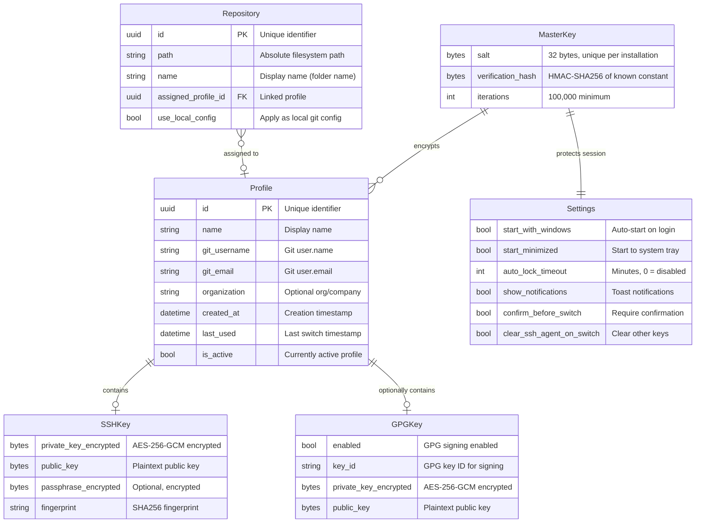
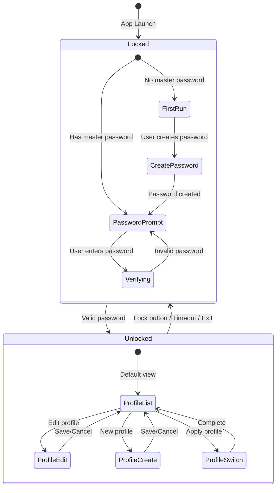
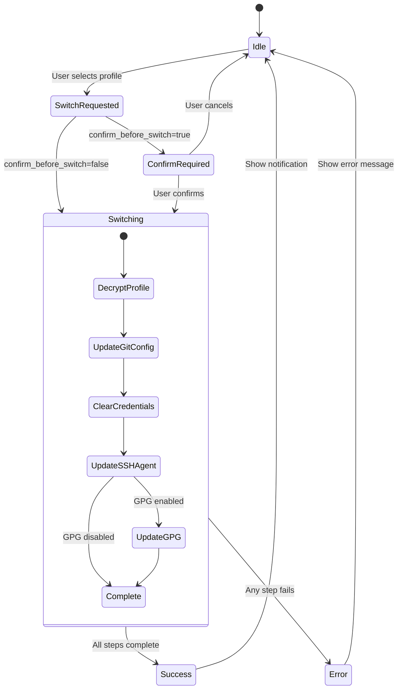

# Data Model: Git-Switch Profile Manager

**Branch**: `001-git-profile-switcher` | **Date**: 2026-01-17

## Overview

This document defines the data entities, their relationships, validation rules, and state transitions for the Git-Switch application.

---

## Entity Relationship Diagram



---

## Entity Definitions

### 1. Profile

The primary entity representing a Git user identity.

```python
from dataclasses import dataclass, field
from datetime import datetime
from uuid import UUID, uuid4
from typing import Optional

@dataclass
class SSHKey:
    """SSH key pair associated with a profile."""
    private_key_encrypted: bytes      # AES-256-GCM encrypted private key
    public_key: bytes                 # Plaintext public key (not sensitive)
    passphrase_encrypted: Optional[bytes] = None  # Encrypted passphrase if key is protected
    fingerprint: str = ""             # SHA256 fingerprint for display

    def __post_init__(self) -> None:
        if not self.private_key_encrypted:
            raise ValueError("SSH private key is required")
        if not self.public_key:
            raise ValueError("SSH public key is required")


@dataclass
class GPGKey:
    """GPG signing key configuration."""
    enabled: bool = False
    key_id: str = ""                  # GPG key ID (e.g., "ABCD1234EFGH5678")
    private_key_encrypted: Optional[bytes] = None
    public_key: Optional[bytes] = None

    def __post_init__(self) -> None:
        if self.enabled:
            if not self.key_id:
                raise ValueError("GPG key ID required when GPG is enabled")
            if not self.private_key_encrypted:
                raise ValueError("GPG private key required when GPG is enabled")


@dataclass
class Profile:
    """A Git user profile with associated credentials."""
    id: UUID = field(default_factory=uuid4)
    name: str = ""                    # Display name (e.g., "Acme Corporation")
    git_username: str = ""            # Git config user.name
    git_email: str = ""               # Git config user.email
    organization: str = ""            # Optional org/company for display
    ssh_key: Optional[SSHKey] = None
    gpg_key: GPGKey = field(default_factory=GPGKey)
    created_at: datetime = field(default_factory=datetime.now)
    last_used: Optional[datetime] = None
    is_active: bool = False

    def __post_init__(self) -> None:
        self._validate()

    def _validate(self) -> None:
        """Validate profile fields."""
        if not self.name or not self.name.strip():
            raise ValueError("Profile name is required")
        if not self.git_username or not self.git_username.strip():
            raise ValueError("Git username is required")
        if not self.git_email or not self.git_email.strip():
            raise ValueError("Git email is required")
        if not self._is_valid_email(self.git_email):
            raise ValueError("Invalid email format")
        if self.ssh_key is None:
            raise ValueError("SSH key is required")

    @staticmethod
    def _is_valid_email(email: str) -> bool:
        """Basic email format validation."""
        import re
        pattern = r'^[a-zA-Z0-9._%+-]+@[a-zA-Z0-9.-]+\.[a-zA-Z]{2,}$'
        return bool(re.match(pattern, email))
```

**Validation Rules**:
| Field | Rule | Error Message |
|-------|------|---------------|
| name | Non-empty, trimmed | "Profile name is required" |
| git_username | Non-empty, trimmed | "Git username is required" |
| git_email | Valid email format | "Invalid email format" |
| ssh_key | Required, valid key | "SSH key is required" |
| gpg_key.key_id | Required if enabled | "GPG key ID required when GPG is enabled" |

---

### 2. Repository

A registered Git repository with optional profile assignment.

```python
from dataclasses import dataclass, field
from pathlib import Path
from uuid import UUID, uuid4
from typing import Optional

@dataclass
class Repository:
    """A registered Git repository."""
    id: UUID = field(default_factory=uuid4)
    path: Path = field(default_factory=Path)       # Absolute path to repo root
    name: str = ""                                 # Display name (default: folder name)
    assigned_profile_id: Optional[UUID] = None     # Linked profile
    use_local_config: bool = True                  # Apply as local vs global config

    def __post_init__(self) -> None:
        self._validate()
        if not self.name:
            self.name = self.path.name

    def _validate(self) -> None:
        """Validate repository configuration."""
        if not self.path or not self.path.is_absolute():
            raise ValueError("Repository path must be absolute")

    def is_valid_git_repo(self) -> bool:
        """Check if path contains a .git directory."""
        return (self.path / ".git").is_dir()
```

**Validation Rules**:
| Field | Rule | Error Message |
|-------|------|---------------|
| path | Absolute path | "Repository path must be absolute" |
| path/.git | Must exist | "Selected folder is not a Git repository" |

---

### 3. Settings

Application configuration (not encrypted - no sensitive data).

```python
from dataclasses import dataclass

@dataclass
class Settings:
    """Application settings."""
    start_with_windows: bool = False
    start_minimized: bool = True      # Start to tray if auto-start enabled
    auto_lock_timeout: int = 15       # Minutes, 0 = disabled
    show_notifications: bool = True
    confirm_before_switch: bool = False
    clear_ssh_agent_on_switch: bool = True

    def __post_init__(self) -> None:
        self._validate()

    def _validate(self) -> None:
        """Validate settings values."""
        if self.auto_lock_timeout < 0:
            raise ValueError("Auto-lock timeout cannot be negative")
        if self.auto_lock_timeout > 1440:  # 24 hours
            raise ValueError("Auto-lock timeout cannot exceed 24 hours")
```

**Validation Rules**:
| Field | Rule | Error Message |
|-------|------|---------------|
| auto_lock_timeout | 0-1440 range | "Auto-lock timeout must be 0-1440 minutes" |

---

### 4. MasterKeyConfig

Master password configuration (verification only, never stores password).

```python
from dataclasses import dataclass

@dataclass
class MasterKeyConfig:
    """Master password configuration for verification."""
    salt: bytes                      # 32 bytes, unique per installation
    verification_hash: bytes         # HMAC-SHA256 of known constant
    iterations: int = 100_000        # PBKDF2 iterations

    def __post_init__(self) -> None:
        self._validate()

    def _validate(self) -> None:
        """Validate master key configuration."""
        if len(self.salt) != 32:
            raise ValueError("Salt must be 32 bytes")
        if len(self.verification_hash) != 32:
            raise ValueError("Verification hash must be 32 bytes")
        if self.iterations < 100_000:
            raise ValueError("Iterations must be at least 100,000")
```

---

## State Transitions

### Application State Machine



### Profile Switch State Machine



---

## Storage Schema

### File Structure

```
%APPDATA%/Git-Switch/
├── config.json           # Settings (unencrypted)
├── master.json           # MasterKeyConfig (salt + verification hash)
├── profiles.dat          # Encrypted profiles blob
├── repositories.json     # Repository registry (unencrypted, no secrets)
├── keys/                 # Encrypted key storage
│   ├── {profile_id}.ssh  # Encrypted SSH key pair
│   └── {profile_id}.gpg  # Encrypted GPG key pair
└── ui_state.json         # Window position, last view (unencrypted)
```

### profiles.dat Format

Binary format with encryption envelope:

```
[4 bytes]  Magic number: "GSPR" (Git-Switch PROfiles)
[4 bytes]  Version: uint32 (currently 1)
[12 bytes] Nonce: AES-GCM nonce
[N bytes]  Ciphertext: AES-256-GCM encrypted JSON
[16 bytes] Auth tag: GCM authentication tag
```

Decrypted JSON structure:
```json
{
  "profiles": [
    {
      "id": "uuid-string",
      "name": "Profile Name",
      "git_username": "username",
      "git_email": "email@example.com",
      "organization": "Org Name",
      "created_at": "2026-01-17T10:30:00Z",
      "last_used": "2026-01-17T12:00:00Z",
      "is_active": true,
      "ssh_key": {
        "fingerprint": "SHA256:..."
      },
      "gpg_key": {
        "enabled": true,
        "key_id": "ABCD1234"
      }
    }
  ]
}
```

Note: Actual key material stored separately in `keys/` directory for security isolation.

---

## Exception Hierarchy

```python
class GitSwitchError(Exception):
    """Base exception for all Git-Switch errors."""
    pass


class AuthenticationError(GitSwitchError):
    """Authentication-related errors."""
    pass


class InvalidPasswordError(AuthenticationError):
    """Incorrect master password."""
    pass


class SessionExpiredError(AuthenticationError):
    """Session has timed out."""
    pass


class EncryptionError(GitSwitchError):
    """Encryption/decryption failures."""
    pass


class ProfileError(GitSwitchError):
    """Profile-related errors."""
    pass


class ProfileNotFoundError(ProfileError):
    """Profile does not exist."""
    pass


class ProfileValidationError(ProfileError):
    """Profile data validation failed."""
    pass


class ServiceError(GitSwitchError):
    """External service interaction errors."""
    pass


class GitServiceError(ServiceError):
    """Git configuration errors."""
    pass


class SSHServiceError(ServiceError):
    """SSH agent errors."""
    pass


class GPGServiceError(ServiceError):
    """GPG keyring errors."""
    pass


class CredentialServiceError(ServiceError):
    """Windows Credential Manager errors."""
    pass


class RepositoryError(GitSwitchError):
    """Repository-related errors."""
    pass


class InvalidRepositoryError(RepositoryError):
    """Path is not a valid Git repository."""
    pass
```

---

## Serialization

All models use standard library `json` for serialization with custom encoders for:
- `UUID` → string
- `datetime` → ISO 8601 string
- `Path` → string
- `bytes` → base64 encoded string

```python
import json
from datetime import datetime
from pathlib import Path
from uuid import UUID
import base64

class GitSwitchEncoder(json.JSONEncoder):
    """Custom JSON encoder for Git-Switch models."""

    def default(self, obj):
        if isinstance(obj, UUID):
            return str(obj)
        if isinstance(obj, datetime):
            return obj.isoformat()
        if isinstance(obj, Path):
            return str(obj)
        if isinstance(obj, bytes):
            return base64.b64encode(obj).decode('ascii')
        return super().default(obj)
```

---

## Summary

| Entity | Storage | Encrypted | Key Fields |
|--------|---------|-----------|------------|
| Profile | profiles.dat | Yes (AES-256-GCM) | name, git_username, git_email, ssh_key, gpg_key |
| SSHKey | keys/{id}.ssh | Yes (AES-256-GCM) | private_key, passphrase |
| GPGKey | keys/{id}.gpg | Yes (AES-256-GCM) | private_key |
| Repository | repositories.json | No | path, assigned_profile_id |
| Settings | config.json | No | All fields |
| MasterKeyConfig | master.json | No (only verification data) | salt, verification_hash |
